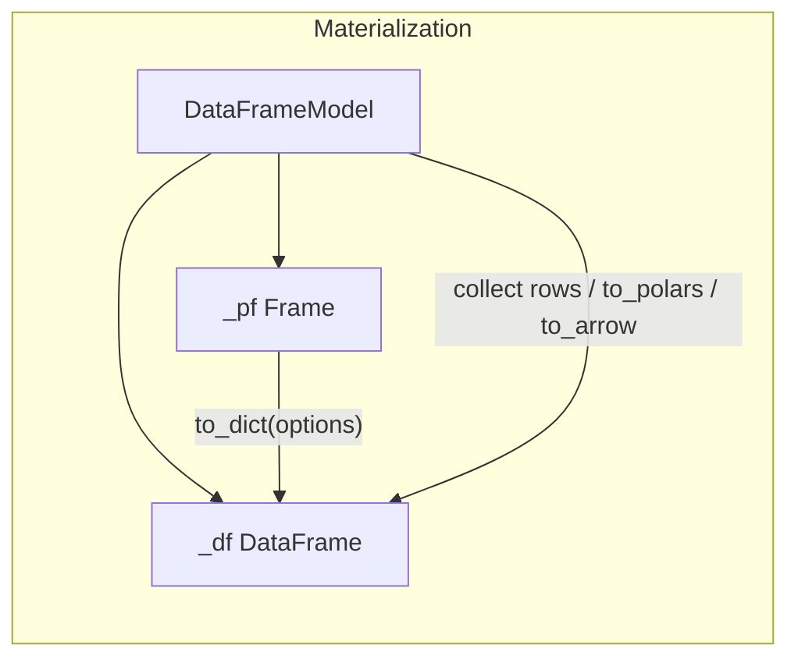

# Roadmap: pydantable as a PlanFrame adapter

This document describes the transition for **pydantable** to behave as a “real engine adapter” for **PlanFrame** (typed planning layer) in the sense described by PlanFrame’s adapter guide.

## North star

- **PlanFrame is the single planning surface** for the `DataFrameModel`-first API.
- **pydantable is the backend engine + adapter**: it compiles PlanFrame expression IR into pydantable expressions, lowers PlanFrame plan nodes into pydantable lazy operations, and materializes results only at execution boundaries.
- **No silent legacy path** inside `DataFrameModel`: if something can’t be expressed/executed via PlanFrame + adapter, it must be an explicit and documented escape hatch (or an explicit error).

## Principles and constraints

- **Always-lazy**: adapter methods must return backend-lazy frames; no backend work should execute during transform chaining.
- **Schema-first determinism**: schema evolution must be computed from PlanFrame schema metadata; execution-time hints must not affect schema.
- **Options at execution boundaries**: streaming / engine streaming / join execution hints belong in PlanFrame `ExecutionOptions` / `JoinOptions` and must be passed to adapter materializers (and join where supported).
- **Typed-by-default**: keep PlanFrame’s “literal column names” ethos at the PlanFrame boundary; keep pydantable’s “annotation-defined schema” ethos at the `DataFrameModel` boundary.
- **Tested parity**: every PlanFrame node / expr we claim to support must be exercised end-to-end in tests using the pydantable adapter.

## Current state (baseline)

- **Dependency:** pydantable pins **PlanFrame `>=1.0.0,<2`** (see `pyproject.toml`). PlanFrame 1.x renamed several **`Frame` methods** compared with older lines (`with_column` → `with_columns`, `concat_vertical` / `concat_horizontal` → `concat(how=…)`, `with_row_count` → `with_row_index`, table reshape `melt` → `unpivot` on `Frame`). **`DataFrameModel` keeps stable user names** (`with_row_count`, `melt`, …) and bridges to the current PlanFrame `Frame` API internally.
- `DataFrameModel` holds a PlanFrame frame (`_pf`) and executes transforms via `pydantable.planframe_adapter.PydantableAdapter` and `planframe.execution.execute_plan` (`execute_frame` in pydantable).
- After each PlanFrame-backed step, `_dfm_sync_pf` runs `execute_frame` so the inner pydantable `DataFrame` (`_df`) matches the compiled plan; `_pf` stores the extended lazy plan.
- **Expression lowering** lives in `python/pydantable/planframe_adapter/expr.py`. End-to-end coverage for the adapter is in `tests/dataframe/test_planframe_adapter_*.py`.

### Materialization path (today)

`collect` / `to_dict` / `to_polars` / `to_arrow` must preserve pydantable’s validation and optional-field semantics on the inner `DataFrame`. Columnar materialization is routed through **`Frame.to_dict(options=ExecutionOptions(...))`** so streaming hints follow PlanFrame’s execution boundary; row-shaped `collect()` (default) and numpy paths still delegate to `DataFrame.collect` on `_df`. See Phase 2.

## Phase 0: “Adapter correctness” hardening

**Goal**: make adapter behavior unambiguous, deterministic, and PlanFrame-aligned.

**Status (partial)**

- **`PydantableAdapter`** implements `collect` / `to_dict` / `to_dicts` with `options: ExecutionOptions | None` and forwards streaming flags to `DataFrame.to_dict` / `to_dicts` (see `python/pydantable/planframe_adapter/adapter.py`).
- **Join** forwards `JoinOptions` where the pydantable engine and adapter support them.
- **`DataFrameModel` public materializers:** columnar **`to_dict`** and **`collect(as_lists=True)`** use PlanFrame **`_pf.to_dict(...)`** so execution-time options align with PlanFrame. Other shapes still use `_df` where required (see Phase 2).

**Remaining / folded into Phase 2**

- Ensure every materialization entry point that accepts streaming-like kwargs either routes through PlanFrame or is explicitly documented as engine-only.

**Acceptance criteria**

- `ruff` + `ty-check-minimal` + `pytest` pass.
- No transform in `DataFrameModel` performs backend work while building the plan.

## Phase 1: PlanFrame expression lowering (`expr.py`)

**Goal:** support a **documented** subset of `planframe.expr.api` with tests; extend the subset as needed.

### 1.1 Supported today (non-exhaustive)

Implemented in `planframe_adapter/expr.py` and covered by adapter tests:

- **Arithmetic / comparisons / boolean / null / membership:** e.g. `Add`, `Eq`, `IsNull`, `IsIn`, …
- **Scalars:** `Abs`, `Round`, `Floor`, `Ceil`, `Coalesce`, `IfElse`, `Between`, `Clip`, `Pow`, `Exp`, `Log`, …
- **Strings:** `StrContains`, `StrStartsWith`, `StrEndsWith`, `StrLower`, `StrUpper`, `StrLen`, `StrStrip`, `StrReplace`, `StrSplit`
- **Datetime parts:** `DtYear`, `DtMonth`, `DtDay`
- **Math:** `Sqrt`, `IsFinite`
- **`AggExpr`:** lowered for ops `count`, `sum`, `mean`, `min`, `max`, `n_unique` (other ops still raise `NotImplementedError`).
- **`Over`:** only when the inner node is `AggExpr` with ops `sum`, `mean`, `min`, `max` (other window shapes raise `NotImplementedError`).

### 1.2 Still open / next

- Any **`planframe.expr.api` node** not handled above falls through to `NotImplementedError("Unsupported PlanFrame expression node: …")`.
- **`AggExpr`** ops outside the supported set.
- **`Over`** with non-`AggExpr` inner expressions.
- New upstream expr nodes: add lowering + tests when pydantable claims support.

**Acceptance criteria**

- No `NotImplementedError` for expression nodes that are **listed as supported** in this section (tests must cover them).
- New nodes require explicit lowering and tests before being advertised.

## Phase 2: `DataFrameModel` and PlanFrame materialization

**Goal**: PlanFrame owns execution-boundary semantics for options where possible; engine-only behavior is explicit.

### 2.1 Route columnar materialization through PlanFrame

**Done / current approach**

- **`to_dict`** and **`collect(as_lists=True)`** call **`_pf.to_dict(options=ExecutionOptions(streaming=…, engine_streaming=…))`**, which evaluates the plan and invokes `PydantableAdapter.to_dict` on the backend frame (same columnar path as `DataFrame.to_dict`).

**Still on `_df` (by design until extended)**

- Default **`collect()`** (row models), **`as_numpy=True`**, **`to_polars`**, **`to_arrow`**, **`acollect` / `ato_dict`**, **`collect_batches`**, **`stream`**: remain on the core `DataFrame` so pydantable row validation, numpy, Arrow, Polars, and async semantics stay centralized.

### 2.2 Escape hatch: core `DataFrame`

**Implemented:** **`DataFrameModel.to_dataframe()`** returns the inner lazy **`DataFrame`** for APIs that are intentionally not wrapped by the PlanFrame-first surface. See {doc}`PLANFRAME_FALLBACKS`.

**Acceptance criteria**

- `DataFrameModel` execution-time streaming options for **`to_dict`** / **`collect(as_lists=True)`** map to PlanFrame `ExecutionOptions`.
- **`to_dataframe()`** is documented and tested.

## Phase 3: Expand PlanFrame-first surface

**Goal**: minimize the need for the escape hatch for common workflows.

### 3.1 Parity areas (evaluate and prioritize)

- **Projection with expressions**: PlanFrame has `project`; expose or document a typed `DataFrameModel`-level API that stays PlanFrame-first.
- **Expr keys in sort/join/group_by**: PlanFrame supports them; pydantable adapter supports them where the engine can (see adapter notes on single-column expr keys).
- **Reshape:** PlanFrame **`Frame`** uses names like **`unpivot`** / **`pivot_*`**; **`DataFrameModel`** keeps user-facing **`melt`** / **`pivot`** and maps to the current PlanFrame nodes.

**Acceptance criteria**

- The documented PlanFrame-first surface covers the majority of workflows without escape hatches.

## Phase 4: Deprecation and cleanup of legacy paths

**Goal**: eliminate dead code and clarify invariants.

- Remove preserved “old backend code after `raise`” once a method has been PlanFrame-backed for at least one release cycle.
- Delete docs that imply `_df`-only fallback behavior for `DataFrameModel` when it no longer exists.
- Optional: CI gates for new `_df`-only transforms on `DataFrameModel`.

**Acceptance criteria**

- `DataFrameModel` is PlanFrame-first by construction for transforms; engine-only behavior is explicit and documented.

## Definition of done

The transition is “done” when:

- `DataFrameModel` is a typed PlanFrame façade (composition) over the pydantable engine adapter for **transforms** and for **columnar materialization** via `_pf.to_dict`.
- Adapter **expr** coverage matches what pydantable documents as supported (`expr.py` + tests).
- Execution-time hints for supported paths use PlanFrame **`ExecutionOptions`** (and **`JoinOptions`** on join) where applicable.
- Any remaining engine-only API is accessed through **`to_dataframe()`** or other documented escape hatches.

## Suggested follow-on work (priority)

| Priority | Work |
|----------|------|
| P1 | Extend `expr.py` for additional `AggExpr` / `Over` shapes the engine can support. |
| P2 | Optional: route more materialization shapes through PlanFrame once parity with `DataFrame` is proven. |
| P3 | Phase 4: audit `NotImplementedError` branches and unreachable post-`raise` code in `DataFrameModel`. |

## See also

- {doc}`PLANFRAME_FALLBACKS` — PlanFrame-first surface vs escape hatch.
- [PlanFrame: Creating an adapter](https://github.com/eddiethedean/planframe/blob/main/docs/guides/planframe/creating-an-adapter.md) — `BaseAdapter` contract.
